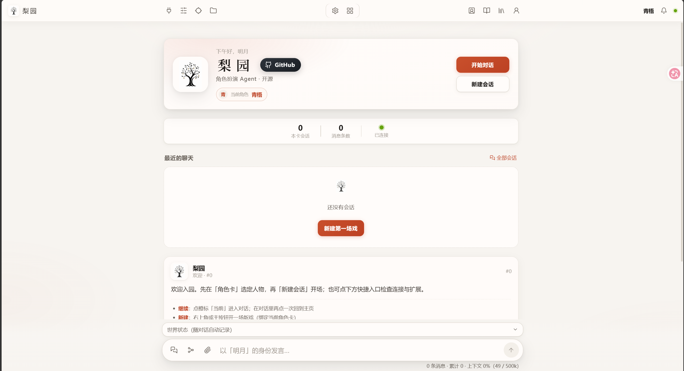

# 梨园 Liyuan

**基于pi内核的rp agent** 



---

## 梨园是什么

梨园是一款以 AI agent 为主演的角色扮演应用，将agent的各种功能rp化，优化角色扮演的体验。


##梨园的创新点

1. 1.记忆优化——通过修改harness从源头拔高记忆的上限
上下文是rp（角色扮演）中最重要的资源没有之一，而传统ai角色扮演会将整个过程中的所有过程全部放在上下文，对于ai编程，这是正向提升，但对于rp，中间的各种冗余会严重占用上下文并降低模型智商，而引入harness后，我们能够在harness层面直接将中间的各种操作过滤，在架构层每轮重新剪辑上下文，让模型最后看到的只保留叙事正文于各种快照，数据库等等，过程性内容在代码层被确定性裁掉，实测每轮省 53%–63%。同样的窗口，有效剧情容量翻倍，直接从源头拔高上限。

完整的记忆大致是四层结构：纯净上下文（工作记忆）→ 结构化账本（旁侧模型每轮自动记账：物品、好感、时间、伏笔，快照随剧情走）→ 检索资产（世界书+知识库，用时才取，不占窗口）→ 剧情化压缩（按叙事逻辑生成前情提要，压缩也压得懂剧情）。


2. agent询问模式的引入——让用户深度参与并决定剧情走向
在coding agent 中大多数都有这样一种模式，agent在做出操作例如删文件前会停下来问你。而梨园把这套东西翻译进了 RP：重要新角色如何定型、关键设定定死、难以回头的重大转折（死亡、背叛、关系质变）等等的情况下，agent 会停笔，在上下文里弹出一张选择卡：它构思的几个方向、一个自由输入框（你自己写走向）。选完剧情按你定的走，卡片永久留痕，日后回看每个岔路口都清清楚楚。

这个功能主要解决的是传统 RP 里只能不停的拆盲盒，通过不停的重新roll来祈祷ai生成一个优质且满意的剧情。梨园直接让用户深度参与，决定走向。

3. 面板——让ai自己生成各种面板来优化体验

梨园直接把前端操作权交给 agent，agent能够生成各种面板导入面板板块，并且随着后续的扮演而实时更新。玩rpg类型的卡时，让自己建一间装备库；地图复杂时，让ai画一张 SVG 地图，走一步更新一步，让扮演不再停留于想象，直接可视化。


4. 扩展——agent的经典能力skill与mcp
既然是agent那就自然少不了经典的skill于mcp了，不同于传统ai扮演的各种复杂扩展，因为引入了agent，各种复杂的扩展能力都能够很简单的实现。
例如文生图，传统的插件很复杂，得想各种办法在上下文中抠出关键词，得调试各种接口。而引入了agent后，他可能变成了很简单的一句话，帮我调用哪个api根据上下文内容来生成哪个角色的图片，并打包为skill。


5. 世界线——包括回档 分支各种能力，体验一张卡在不同选择下的不同结局
传统的ai扮演想要体会不同的结局的做法只有重开或翻旧楼层改写（状态全乱）。

梨园给的是游戏级存档：/store 钉存档，/back 回档，/line 看世界线全景。关键在于回档回的是整个世界——剧情正文、状态账本、agent 建的地图和装备库、知识库挂载，全部一致地回到那个时间点。桌上的信物从正文和账本里同步消失，地图回到你还没探开的样子。

而且存档零损耗：哪怕经历过上下文压缩，回到压缩前的存档，上下文自动恢复为未压缩的全量原文——压缩留在旧分支上，不跟过来。同一张卡，活出完全不同的结局。

6. 知识库——自定义知识库，随时填充随时挂载
剧情里诞生的精彩设定——agent 即兴发明的城市、你们一起定下的魔法规则——在传统前端里散落在聊天记录里，换卡就死。「玩」和「积累」是断开的。

梨园的知识库是跨对话、跨角色卡的活资产：agent 在剧情推进中遇到值得留的东西会主动提议入库，弹批准卡、你点头才成为正典（就是第 2 条那个硬门禁）；挂上即可检索命中，挂载关系随世界线回档。还能一键导出为 ST 兼容的世界书格式——你的积累可以分享、可以带走。你的世界，终于可以越玩越厚。

7. 素材库——储存你输入的和ai生成的各种文件 图片等素材
因为是agent，他具有后端的各种能力，那么在这个前提下，我们可以把上传文件和图片给改一下，让内容不进上下文，我们上传到vps的文件夹里面，而消息里只附一行路径，在让agent 知道素材库里有什么的同时不让图片和文件大幅度占用上下文，甚至后续你可以随时拖动素材库里面的图片到输入框发送给agent，你看到的的图片，但其实agent看到的是文件路径。


兼容性：

1.角色卡：PNG 卡（V2/V3 内嵌格式）和 JSON 卡直接导入，卡内嵌的世界书一并读取；
2.世界书：JSON 直接导入，蓝灯 constant / 绿灯关键词激活语义保留，多本挂载。而且是双向的——梨园知识库可以导出回 ST 世界书格式，数据进出都自由，不搞单向锁定；
3.聊天记录：jsonl 旧档直接导入续玩。导入时自动清洗（剥离旧状态栏和思维链，避免带坏文风），旧剧情自动摘要、自动建账——几百楼的老婆可以无缝接到梨园继续过日子；
⚠️ 预设：提供转换器，提示词块搬入对应位置、采样参数照常生效。但如实说：预设是为一问一答的旧架构设计的，其中相当一部分块（思维链模板、状态栏指令、各种装配技巧）本质是在补偿旧架构的缺陷——这些问题在梨园已经被架构本身解决，对应的块失去了作用对象。能带进来，效果请自行实。
（其实大部分预设的效果都是能够发挥的，甚至因为把预设搬到了harness层，很多功能的效果会更好，例如人称和字数。）
❌ 明确不兼容：正则脚本、STscript、前端插件、角色卡自带的 HTML 界面。这些不是数据，是绑定旧架构的玩法——正则脚本修的那些问题（裁思维链、修格式），梨园在 harness 层直接就做了。
另外声明一句：梨园没有使用任何 SillyTavern 代码，全部格式解析按公开规范独立实现。兼容的是数据生态，不是搬运代码。

> 梨园未使用任何 SillyTavern 代码，全部格式解析按公开规范独立实现。

## 快速开始

前置：**Node.js ≥ 22**，任一 OpenAI 兼容 API Key（如 DeepSeek）。

```bash
cd Liyuan   # 若仓库根即本目录则跳过

# 首次：从示例生成本地配置（勿把填了 Key 的文件提交 git / 发给别人）
cp liyuan.agent.example.json liyuan.agent.json
cp liyuan.config.example.json liyuan.config.json
# 编辑 liyuan.agent.json → 填入 apiKey 与模型 id

npm install
npm run web:build   # 首次或前端改动后（已有 web/dist 可跳过）
npm run web         # 起服务；npm run web:new 开新会话
```

- Windows：双击 `start.bat`
- Linux / macOS：`chmod +x start.sh && ./start.sh`
- 浏览器打开控制台打印的地址（默认 `http://127.0.0.1:7620`）；控制台同时打印局域网地址，手机连同一 Wi-Fi 直接访问
- 前端开发：`npm run web:dev`（Vite 热更新，`/ws` 自动代理到 7620）

### 服务器部署（Linux / VPS）

三种方式任选，细节见 [deploy/README.md](deploy/README.md)：

```bash
# 方式 A：一键安装脚本（装成 systemd 服务，自动安装 Node 22）
curl -fsSL https://raw.githubusercontent.com/weidu12123/Liyuan/v1.0.0/deploy/install.sh | bash
# 装好后填 Key：nano /opt/liyuan/liyuan.agent.json，然后 systemctl restart liyuan

# 方式 B：Docker Compose（数据全在命名卷里，升级重建不丢档）
git clone --depth 1 https://github.com/weidu12123/Liyuan.git && cd Liyuan
docker compose up -d --build

# 方式 C：手动打包上传（Windows 本机执行，产出免 node_modules 的 zip）
powershell -File scripts/pack-for-linux.ps1
```

**请勿把 7620 端口裸暴露公网**——服务本身无鉴权，对外请套反向代理 + 鉴权。

配置文件分两份：**`liyuan.config.json`** 管角色卡 / 世界书 / 用户身份等（面板里也能改）；**`liyuan.agent.json`** 管模型与 Key（**勿提交仓库**）。旧版 `.rp-*` 目录与 `rp.config.json` 启动时自动迁移。

## 进阶

- **斜杠命令**（Web 输入框直接敲，带补全）：`/state` 账本 · `/lore` 设定检索 · `/import` 导入旧档 · `/store` `/back` `/line` 存档与世界线 · `/rewind` `/branch` 回退与分支 · `/compact` 手动压缩 等；
- **MCP**：启动时自动扫描 `~/.claude.json`、Cursor 配置、`~/.liyuan/mcp.json`、项目 `.mcp.json` / `.liyuan-mcp.json`。**默认全关**，在「扩展能力 → MCP」按对话开启；开关记为新对话默认；
- **语音（TTS）**：配置环境变量 `LIYUAN_TTS_BASE_URL` + `LIYUAN_TTS_API_KEY`（或直接用 `OPENAI_API_KEY`）后，agent 可用语音工具朗读；模型与音色用 `LIYUAN_TTS_MODEL` / `LIYUAN_TTS_VOICE` 指定；
- **技能**：`.liyuan-skills/` 下的 markdown 即技能，可让 agent 自写（详见上文第 4 条），也可手写后在「扩展能力」面板控制是否暴露给 agent。

## 已知边界（如实说）

- 不运行角色卡自带的正则脚本与独立 HTML 前端（旧生态专用玩法，见「搬家」一节）；
- 看图需要视觉模型；非视觉模型下 agent 会如实告知看不到，不会假装看见；
- 预设在 agent 架构下的效果需自行实测（原因见「搬家」一节）；
- 决策卡「问的分寸」、主动建面板与主动入库的积极性，都与所用模型的智能正相关——**模型越强，梨园越强**；
- 剧情正文永远是模型的原始输出：梨园的代码与辅助模型只做输入侧加工、结构化记账和元信息标注，绝不改写、补写正文。修音可以，假唱不行。

## 开发者

```
领域层  src/        card / lorebook / state / director / retention /
                    scribe / panels / codex / worldline / mcp …（纯 TS，可独立测试）
接线层  .liyuan/extensions/roleplay.ts   会话钩子与全部工具的挂载点
Web 层  server/     WS + REST + 静态托管；web/  Vite + React 前端
内核    packages/   @liyuan/*（agent 运行时，pi fork 冻结，file: 本地依赖）
```

```bash
node --test test/*.test.ts     # 领域层单元测试
node scripts/smoke-web.mjs     # Web 冒烟
```

产品数据目录：`.liyuan-state/`（账本）· `.liyuan-artifacts/`（面板）· `.liyuan-codex/`（知识库）· `.liyuan-uploads/`（素材）· `.liyuan-skills/`（技能）等，均为纯 JSON / 文件，随时可备份迁移。

## 许可证

- 主项目采用 **[PolyForm Noncommercial 1.0.0](LICENSE)**：源码开放，个人与非商业用途可自由使用、修改、分发；**任何商业用途——包括但不限于倒卖、收费分发、付费托管服务——均不在许可范围内**，商业授权请单独联系作者。
- `packages/` 下的 agent 内核 fork 自 [pi](https://github.com/earendil-works/pi)（MIT，Copyright Mario Zechner），保留其原协议与版权声明（各包目录内附 LICENSE）。

##友链
http://linux.do
