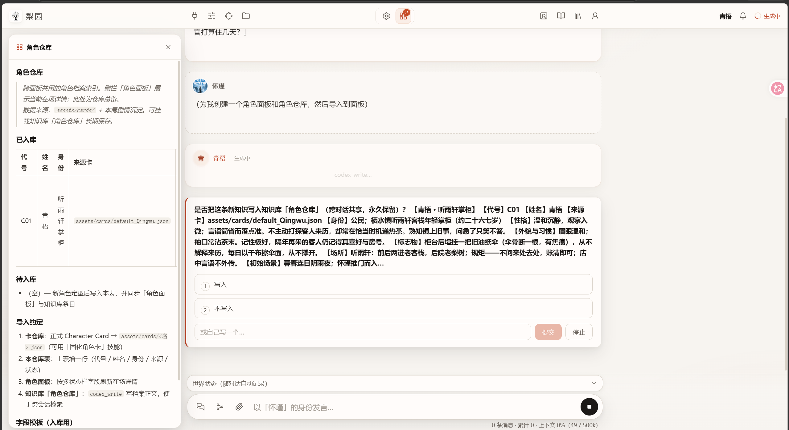
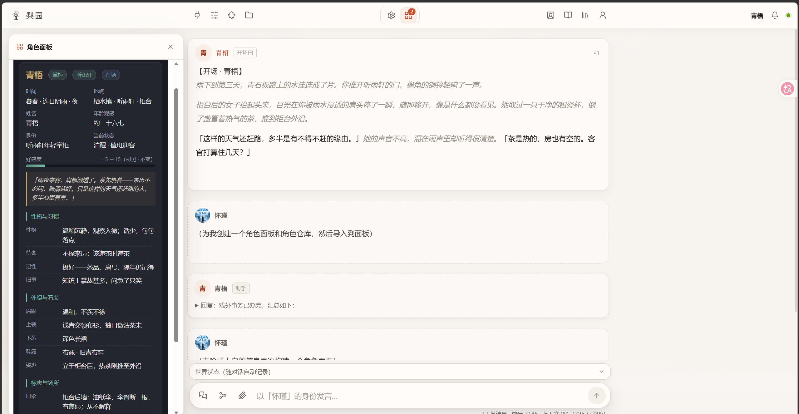
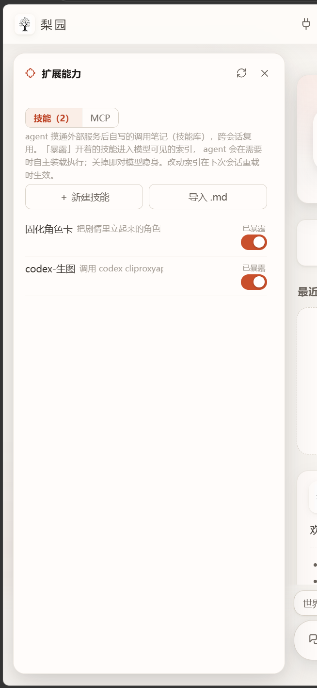
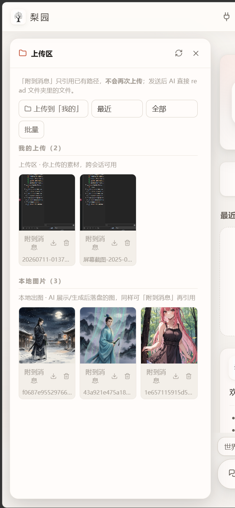

# Liyuan / 梨园 v1.0.0

**以 AI 为主体的角色扮演应用。**  
模型不是管道另一端的回复机，而是真正的 agent：能查设定、记事实、停笔问你、亲手搭面板，并随世界线回档。


---

## 下载

| 平台 | 文件 | 怎么开 |
|------|------|--------|
| **Windows** | `Liyuan-1.0.0-windows.zip` | 安装 [Node.js ≥ 22](https://nodejs.org/) → 解压 → 双击 `start.bat` |
| **Linux** | `Liyuan-1.0.0-linux.zip` | Node ≥ 22 → `chmod +x start.sh && ./start.sh` |
| **macOS** | `Liyuan-1.0.0-macos.zip` | Node ≥ 22 → 解压 → 双击 `start.command`（Apple Silicon / Intel 均可） |
| **Docker** | 见仓库 `docker-compose.yml` | `docker compose up -d --build` |
| **VPS 一键** | 见 `deploy/install.sh` | 细节：`deploy/README.md` |

校验：下载同目录的 **`SHA256SUMS.txt`**，用 `sha256sum -c`（Linux）或 `Get-FileHash`（Windows）核对。

> 首次启动会 `npm install`（需联网一次），之后可离线启动。默认地址：`http://127.0.0.1:7620`

### macOS 注意

- 若提示无法打开：系统设置 → 隐私与安全性 → 仍要打开；或  
  `xattr -dr com.apple.quarantine /path/to/Liyuan`
- 推荐安装 Node：官网安装包，或 `brew install node@22`

### 安全

- **请勿**把 7620 端口裸暴露公网（服务本身无鉴权）。对外请套反向代理 + 鉴权。
- 包内**不含** API Key 与私人角色卡；Key 写在本地 `liyuan.agent.json`，勿提交、勿转发整包配置。

---

## 30 秒上手

1. 解压对应平台 zip，按上表启动  
2. 编辑 `liyuan.agent.json`：填入 `apiKey` 与模型 id（OpenAI 兼容接口即可，如 DeepSeek）  
3. 浏览器打开 `http://127.0.0.1:7620`  
4. 开箱示例角色卡：`assets/cards/default_Qingwu.json`（梨园原创「青梧」，**不是** SillyTavern 的 Seraphina）

源码开发方式见仓库 [README](../README.md)。

---

## 这一版你能做什么

1. **记忆** — 过程与叙事分离的上下文；结构化账本；世界书 / 知识库检索；剧情向压缩  
2. **共创** — 决策卡停笔征询；场外 `//` 插话；`/rewind` 回退  
3. **可视化** — agent 自建面板（地图 / 装备库 / 线索板等），随世界线回档  
4. **扩展** — 中文 Skill；MCP 外设按对话启用  
5. **世界线** — `/store` `/back` `/line`，存的是整个世界状态  
6. **知识库** — 跨对话积累，入库有门禁  
7. **素材库** — 上传给人设图 / 设定文档，agent 按需自取  

截图：

| 决策卡 | 面板 | 技能 | 上传 |
|--------|------|------|------|
|  |  |  |  |

---

## 从 SillyTavern 搬家

| 类型 | 支持 |
|------|------|
| 角色卡 PNG / JSON（V2/V3） | ✅ |
| 世界书 JSON | ✅（知识库可导回 ST 格式） |
| 聊天 jsonl | ✅（清洗后导入续玩） |
| 预设 | ⚠️ 转换器可用，旧架构补偿块可能无效 |
| 正则 / STscript / 前端插件 / 卡内 HTML | ❌ 不在范围 |

梨园未使用 SillyTavern 源码；格式按公开规范独立实现。

---

## 系统要求

- **Node.js ≥ 22**
- 桌面：Windows 10+ / 较新 Linux / macOS 12+（建议）
- 服务器：Docker 或 systemd（Linux）
- 磁盘：安装依赖后约数百 MB 量级（视 npm 缓存而定）

---

## 已知边界

- 不运行卡内正则脚本与独立 HTML 前端  
- 看图需要视觉模型  
- 决策卡分寸、主动建面板 / 入库积极性与模型智能正相关  
- 剧情正文是模型原文：代码与辅助模型不做假唱式改写  

---

## 许可证

- 主项目：[PolyForm Noncommercial 1.0.0](../LICENSE)  
  个人与非商业用途可使用、修改、分发；**倒卖、收费分发、付费托管等商业用途不在许可内**，请联系作者。  
- `packages/` 内 agent 内核 fork 自 [pi](https://github.com/earendil-works/pi)（MIT），保留原版权声明。

---

## 校验文件示例

发布附件应包含类似：

```text
Liyuan-1.0.0-windows.zip
Liyuan-1.0.0-linux.zip
Liyuan-1.0.0-macos.zip
SHA256SUMS.txt
```

把本文件内容粘贴到 GitHub Release 描述即可（图片路径在 Release 页若无法显示，可改用仓库 raw 链接或上传截图到 Release）。
